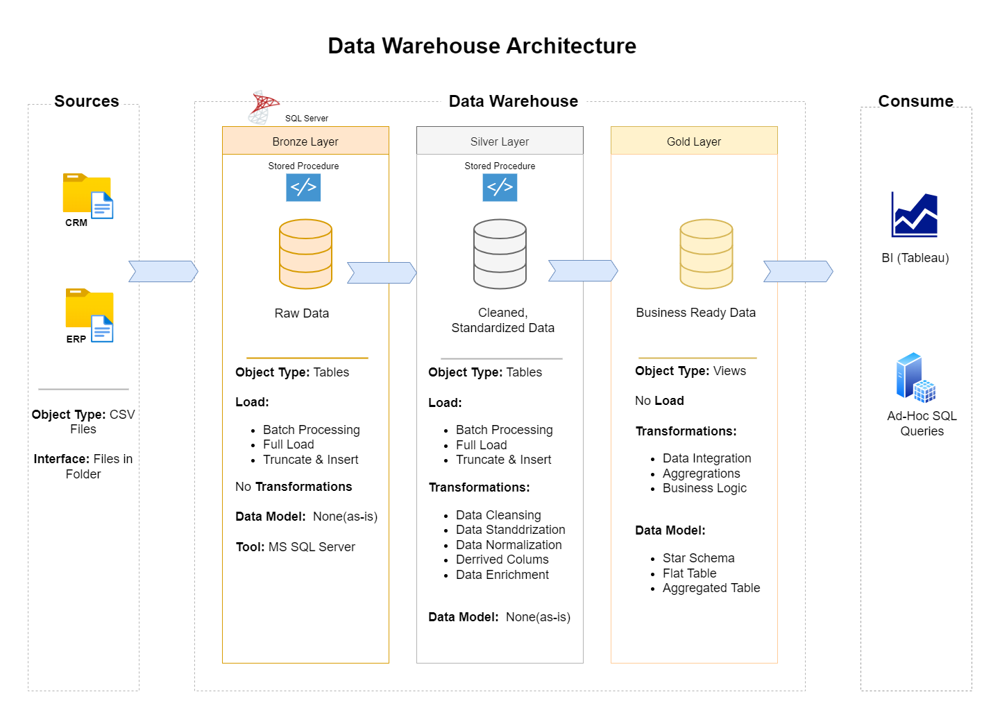

# sql-data-warehouse-project
Welcome to the Data Warehouse and Analytics Project repository! 🚀   
This guided project demonstrates a data warehousing and analytics solution, from building a data warehouse to generating actionable insights. 
# Data Architecture
The data architecture for this project follows Medallion Architecture Bronze, Silver, and Gold layers:

**1.Bronze Layer:** Stores raw data as-is from the source systems. Data is ingested from CSV Files into SQL Server Database.  
**2.Silver Layer:** This layer includes data cleansing, standardization, and normalization processes to prepare data for analysis.  
**3.Gold Layer:** Houses business-ready data modeled into a star schema required for reporting and analytics.
